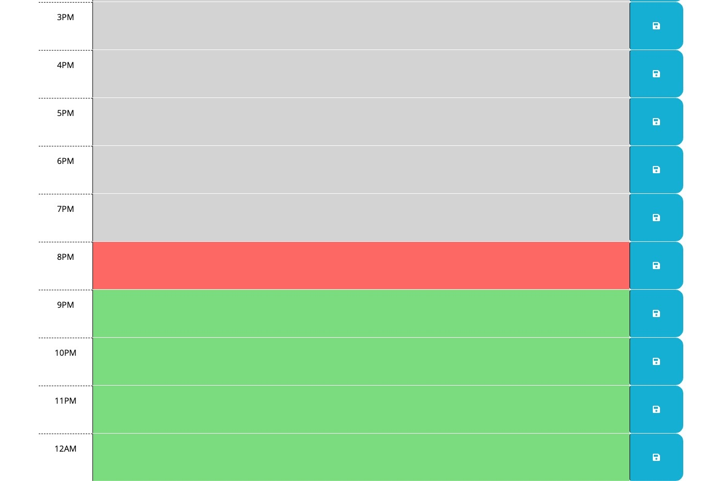

# UTA-Bootcamp-Challenge5

# Work Day Scheduler

## Description 
Create a simple calendar application that allows a user to save events for each hour of the day by modifying starter code. This app will run in the browser and feature dynamically updated HTML and CSS powered by jQuery.

## Installation

The instruction are just to enter your task for tha day for that hour. You will then click the save button on the right for each block hour and the details for that hour are store on the website. If you close the website the details for that hour and day will still appear. 
https://chriszavala.github.io/UTA-bootcamp-challenge5/

## Usage

Here is a screenshot provided of the first page of the Work Day Scheduler 

## Acceptance Criteria

GIVEN I am using a daily planner to create a schedule
WHEN I open the planner
THEN the current day is displayed at the top of the calendar
WHEN I scroll down
THEN I am presented with timeblocks for standard business hours
WHEN I view the timeblocks for that day
THEN each timeblock is color coded to indicate whether it is in the past, present, or future
WHEN I click into a timeblock
THEN I can enter an event
WHEN I click the save button for that timeblock
THEN the text for that event is saved in local storage
WHEN I refresh the page
THEN the saved events persistwork

## Credits

List your collaborators, if any, with links to their GitHub profiles.

List your collaborators: 
Christopher Zavala: https://github.com/ChrisZavala 
Josh Goeke: https://github.com/joshuagoeke
Karen Peazzoni: https://github.com/kpeazzoni

## License

Please refer to the LICENSE in the repo.

---

## Tests

N/A